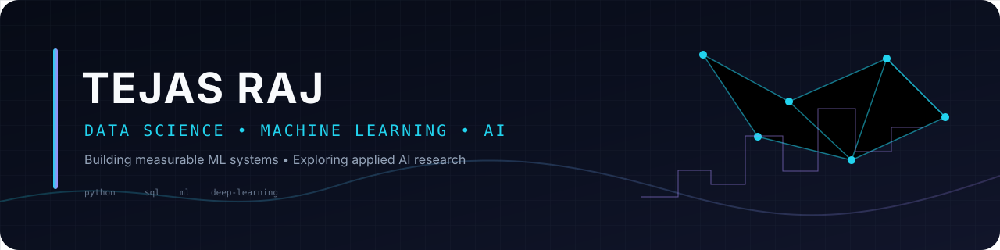
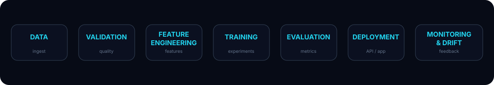
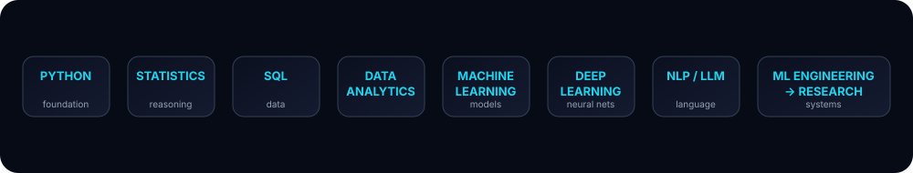

  

  
  
  

  

---

## About

I'm a final-year **B.E. Data Science Engineering** student working toward **ML engineering and applied AI research**. I’m interested in the parts of machine learning that matter beyond a notebook: careful validation, reproducible experiments, error analysis, explainability, and reliable deployment.

- **Approach:** measure before claiming, avoid leakage, document assumptions
- **Building:** a focused set of end-to-end projects with reproducible experiments
- **Direction:** Data Analytics → Data Science → Machine Learning → Deep Learning → ML Engineering → AI Research

## Technical Skills

  

**Data Science:** Python · SQL · Pandas · NumPy · Matplotlib · Seaborn · Plotly · Power BI · Tableau · Excel · Streamlit

**Machine Learning:** Scikit-learn · TensorFlow/Keras · PyTorch · Feature Engineering · Cross-validation · Model Evaluation · Explainability

**Engineering:** Git · GitHub · Linux · FastAPI · Docker · MLflow · JavaScript · React

---

## Flagship Project Roadmap

I’m building a small number of technically substantial projects rather than a large collection of toy notebooks.

| Area | Project direction | Key skills |
|---|---|---|
| Analytics | E-commerce analytics platform | SQL, cohorts, RFM, dashboards |
| ML | Credit-risk decision system | pipelines, calibration, thresholds |
| Advanced ML | Predictive maintenance | time series, feature engineering, SHAP |
| Deep Learning | ECG signal classification | 1D CNNs, robust evaluation |
| LLM / RAG | Scientific document intelligence | retrieval, reranking, evaluation |
| Computer Vision | Industrial anomaly detection | representation learning, localization |
| MLOps | Production ML serving platform | FastAPI, Docker, MLflow, CI/CD |
| Research | Robustness under distribution shift | ablations, calibration, error analysis |

> **Status:** these projects are built and published incrementally. Metrics are added only after experiments are actually run.

---

## ML System Design

  

The goal is to move from isolated notebooks toward reproducible systems: validated data, versioned experiments, measurable evaluation, serving, and monitoring.

---

## Research & Experimentation

One project will follow a research-style workflow:

**Question → Hypothesis → Baseline → Controlled Experiments → Ablations → Error Analysis → Conclusions → Limitations**

A research-style project is clearly labeled as such; it is not presented as published research unless it actually is.

---

## GitHub Activity

  
  

  

  <picture>
    <source media="(prefers-color-scheme: dark)" srcset="https://raw.githubusercontent.com/tejasraj-da/tejasraj-da/output/github-contribution-grid-snake-dark.svg">
    <source media="(prefers-color-scheme: light)" srcset="https://raw.githubusercontent.com/tejasraj-da/tejasraj-da/output/github-contribution-grid-snake.svg">
    
  </picture>

---

## Roadmap

  

---

## Currently Learning

- Deep Learning: sequence models, transformers, PyTorch
- LLM systems: retrieval, embeddings, reranking, evaluation
- ML engineering: FastAPI, Docker, MLflow, CI/CD, monitoring
- Research: papers, experimental design, ablations, reproducibility

## Contact

  
  

  Build carefully. Measure honestly. Learn continuously.

